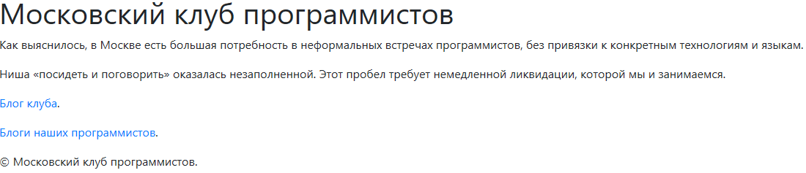
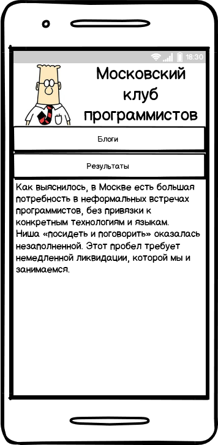
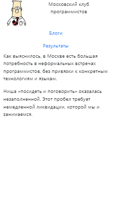
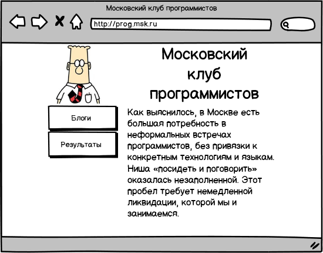
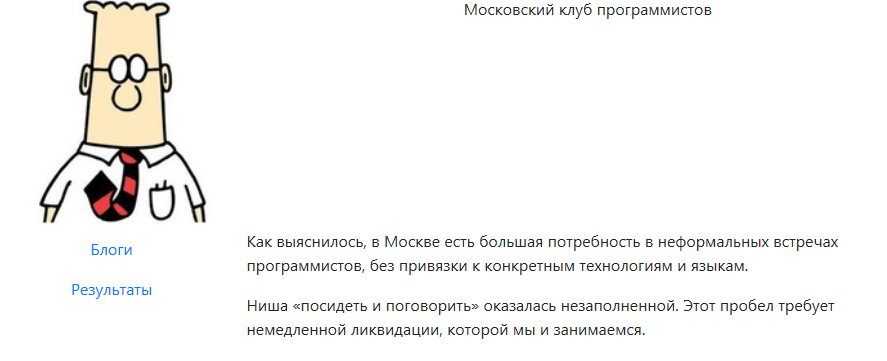

## Зачем нужен Bootstrap

Разработка хорошего веб-дизайна всегда была делом непростым. Я имею в виду не творческие сложности, а ремесленные. Вёрстка сайта,
который правильно выглядит на разных устройствах, требует большого опыта.

Сейчас ситуация стала проще. С одной стороны, [комитет](http://www.w3.org/) принимает действительно [важные стандарты](http://www.w3.org/TR/css-grid-1/).
С другой&nbsp;&mdash; разработчики оперативно реализуют их в браузерах.

Но сложности при вёрстке всё равно возникают. Начнём с того, что разные браузеры используют разные умолчания. Шрифты, размеры,
отступы, поля&nbsp;&mdash; всё это не регламентировано, и всё это пользователь может изменить. Чтобы наш сайт выглядел
одинаково в разных браузерах, мы должны явно установить стили для всех элементов, а их сейчас в стандарте более сотни.

Эту работу придётся повторять для каждого нового сайта. Но CSS позволяет переопределять стили, благодаря чему мы можем упростить себе жизнь.
Сделаем *разумный* набор умолчаний и станем применять его на всех сайтах. Если нам понадобятся нестандартные стили для нескольких
элементов, мы можем изменить только их.

Так мы решаем проблему с отображением сайта на одинаковых устройствах, например, на мониторах. А как быть со смартфонами?

Одно время была популярна идея, что для разных устройств нужно делать разный дизайн. Сейчас, за счёт богатых средств CSS, предпочитают
делать один *адаптиваный* дизайн для нескольких устройств.

*Адаптивный* означает, что сайт адаптируется под устройства, на которых отображается, чтобы работать с ним было удобно.
Структурно, страницы сайта состоят из нескольких блоков: навигации, основного содержимого, логотипа, контактных данных и так далее. Эти блоки
по разному размещаются на устройствах разных размеров. На широком десктопе элементы навигации расположены рядом друг с другом, а на узком
смартфоне&nbsp;&mdash; друг под другом.

Мониторы 16:9 располагают к многоколоночному дизайну, а смарфоны&nbsp;&mdash; к одноколоночному.

[Bootstrap](https://getbootstrap.com/) помогает в решении всех перечисленных проблем:

1. Устанавливает разумные умолчания для стилей.
1. Реализует сеточную модель для вёрстки в несколько колонок.
1. Расширяет сеточную модель для устройств разных размеров.

## Подключаем Bootstrap

Добавим ссылку на Bootstrap CSS в заголовок шаблона **\_layouts/default.html**:


```liquid
<!doctype html>
<html lang="{{ page.lang | default: site.lang }}">
  <head>
    <meta charset="utf-8">
    <meta http-equiv="X-UA-Compatible" content="IE=edge">
    <meta name="viewport" content="width=device-width, initial-scale=1">
    <title>{{ page.title | escape }}}{{ site.title | escape }}</title>
    <meta name="description" content="{{ page.excerpt | default: site.description | strip_html | normalize_whitespace | truncate: 160 | escape }}">
    <link rel="stylesheet" href="https://maxcdn.bootstrapcdn.com/bootstrap/4.1.0/css/bootstrap.min.css">
    
  </head>
  <body>
    {{ content }}
  </body>
</html>
```	


Мы не копируем файл стилей в свой проект, а ссылаемся на общедоступный ресурс. Bootstrap широко распространён и есть шанс, что
при загрузке сайта файл **bootstrap.min.css** уже лежит в кеше и будет загружен оттуда.

Наши собственные стили в файле **css/main.scss** удалим из заголовка и из репозитория. После внесения изменений, главная страница станет выглядеть так:

{: .picture}

Мы видим, что изменились шрифты, и страница в целом стала выглядеть приятнее. Однако текст растянут на всю ширину экрана, и отступов нет.

## Продумываем структуру сайта

Прежде, чем приступить к разработке макета, полезно подумать о том, для чего нам нужен сайт. Изначально клуб программистов создавался,
как место неформальных встреч. Оказалось, что на встречи *общего характера* люди не приходят, потому что не понимают,
что там будет. Мы стали формулировать *тему* встречи, и люди стали приходить. Посиделки перестали быть *неформальными*, но
к жёсткому регламенту мы тоже не пришли.

Дискуссии случаются разные, но если их удаётся удержать в конструктивном русле, в конце встречи мы получаем объёмную картину предмета обсуждения.
Такая картина оказывается нужна и другим программистам, и смежным специалистам. У нас бывают и доклады, тогда результатом встречи становится
презентация или видеозапись.

Мы производим продукт, который может быть полезен другим людям, значит, этим продуктом надо делиться. Помимо главной страницы, где надо
рассказать «кто мы такие», добавим раздел **Результаты**, где разместим конспекты встреч, видеозаписи и презентации.

Мы также хотим помочь нашим программистам продвигать свои страницы. Самым простым способом продвижения является ссылка на сайт, но мы пойдём
дальше&nbsp;&mdash; будем собирать записи из блогов и публиковать их у себя. Интернет-маркетологи называют такой способ продвижения *синдикацией контента*.

Для публикации анонсов и ссылок нам потребуется страница **Блоги**. Таким образом на нашем сайте будут **Главная страница**, раздел **Результаты**
и страница **Блоги**.

## Дизайн для мобильных устройств

В соответствии с подходом *mobile first* сначала разработаем макет для мобильного устройства. Традиционно, на главную страницу сайта
переходят, щёлкнув по логотипу. Нашим логотипом станет [Дилберт](http://dilbert.com/) из комиксов Скотта Адамса.

Пусть мобильный сайт выглядит приблизительно так:

{: .picture}

Прежде, чем верстать макет, поговорим о сеточной модели Bootstrap. Она похожа на табличную модель HTML: точно также состоит из *строк* и *ячеек*.
Но в HTML размер и количество *ячеек* в разных *строках* должны совпадать, а в Bootstrap нет. Вы добавляете *ячейки* в *строку*, указывая их ширину.
Как только очередная *ячейка* не помещается в *строке*, она переносится в следующий ряд, а *строка* увеличивает высоту, чтобы вместить два ряда
*ячеек*.

Ширина ячеек не может быть произвольной. Страница целиком делится на 12 колонок, ширина колонки&nbsp;&mdash; это минимальная ширина ячейки.
Мы можем создавать ячейки кратной ширины, то есть двойной, тройной, и так далее.

Пользуясь этой схемой, сверстаем шапку сайта:

```html
<div class="container">
    <div class="row no-gutters">
      <a class="col-3" href="/"></a>
      <div class="col-9 text-center">Московский клуб программистов</div>
    </div>
</div>
```

Каждая строка размещается в блоке `row`, а все строки надо поместить в блок `container`. Bootstrap настраивает отступы,
чтобы текст в соседних ячейках не слипался друг с другом. Отступы в шапке сайта помешают нам правильно установить размеры логотипа,
поэтому мы добавили к *строке* класс `no-gutters`, который их уберёт.

Портрет Дилберта займёт четверть страницы по ширине. Общая ширина страницы составляет двенадцать единиц, значит, четверь это три единицы.
Сам портрет должен быть размещён внутри ссылки, которая ведёт на главную страницу сайта. Установим у ссылки нужную ширину,
назначив ей класс `col-3`. Ширину изображения внутри ссылки сделаем максимальной (`100%`), чтобы портрет занимал всё выделенное место.
Высота `auto` означает, что изображение сохранит пропорции.

Справа от изображения разместим текст **Московский клуб программистов**. Это заголовок, но к размерам этого текста мы вернёмся позже.
Вторая ячейка должна заполнить строку до конца, и, поскольку три единицы ширины занимает портрет Дилберта, ширина ячейки должна составить девять единиц (`col-9`).

Следующая строка будет состоять из панели навигации и основного текста. В зависимости от ширины экрана, панель навигации будет находиться либо над
содержимым, либо рядом с ним. На узких устройствах эти два блока должны размещаться вертикально.

```html
<div class="row">
  <nav class="col-12">
    <ul class="nav nav-fill flex-column">
      <li class="nav-item">
        <a class="nav-link" href="/syndication/">Блоги</a>            
      </li>
      <li class="nav-item">
        <a class="nav-link" href="/posts/">Результаты</a>
      </li>
    </ul>
  </nav>
  <main class="col-12">
    <p>Как выяснилось, в Москве есть большая потребность в неформальных встречах программистов,
    без привязки к конкретным технологиям и языкам.</p>
                
    <p>Ниша «посидеть и поговорить» оказалась незаполненной.
    Этот пробел требует немедленной ликвидации, которой мы и занимаемся.</p>
  </main>
</div>
```

Сначала мы вставляем панель навигации `nav` шириной двенадцать единиц. Затем вставляем область основного содержимого `main` также
шириной двенадцать единиц. Поскольку они не поместятся в одной строки, Bootstrap разместит панель навигации над содержимым.
Оба блока займут всю ширину устройства.

Очень часто набор ссылок верстают как ненумерованный список. Bootstrap поддерживает подобное соглашение. Класс `nav` у элемента `ul`
говорит о том, что список будет отображаться, как панель навигации. Класс `flex-column` размещает ссылки вертильно, а не горизонтально.
Класс `nav-fill` выравнивает текст ссылок по центру и делает их настолько широкими, насколько это возможно.

Теперь сведём всё вместе в файле **\_layouts\default.html**.


```liquid
<!doctype html>
<html lang="{{ page.lang | default: site.lang }}">
  <head>
    <meta charset="utf-8">
    <meta http-equiv="X-UA-Compatible" content="IE=edge">
    <meta name="viewport" content="width=device-width, initial-scale=1">
    <title>{{ page.title | escape }}}{{ site.title | escape }}</title>
    <meta name="description" content="{{ page.excerpt | default: site.description | strip_html | normalize_whitespace | truncate: 160 | escape }}">
    <link rel="stylesheet" href="https://maxcdn.bootstrapcdn.com/bootstrap/4.1.0/css/bootstrap.min.css">
    
  </head>
  <body>
    <div class="container">
      <div class="row no-gutters">
        <a class="col-3" href="/"></a>
        <div class="col-9 text-center">Московский клуб программистов</div>
      </div>
      <div class="row">
        <nav class="col-12">
          <ul class="nav nav-fill flex-column">
            <li class="nav-item">
              <a class="nav-link" href="/syndication/">Блоги</a>            
            </li>
            <li class="nav-item">
              <a class="nav-link" href="/posts/">Результаты</a>
            </li>
          </ul>
        </nav>
        <main class="col-12">
          {{ content }}
        </main>
      </div>
    </div>
  </body>
</html>
```	


И вот что у нас получается на мобильном устройстве.

{: .picture}

## Дизайн для мониторов

На широком мониторе панель навигации располагают рядом с текстом. Следуя этой традиции попробуем сверстать такой макет:

{: .picture}

В мобильном шаблоне мы указали, что навигация должна занимать всю ширину экрана, также, как и содержимое. Сейчас
мы доработаем это правило. На больших экранах навигация должна занимать четверть ширины, так же, как и портрет Дилберта.
Надпись **Московский клуб программистов** расположим точно над содержимым, так что ему останется три четверти ширины.

Вопреки ожиданиям, делается это несложно.


```liquid
<nav class="col-12 col-lg-3">
  <ul class="nav nav-fill flex-column">
    <li class="nav-item">
      <a class="nav-link" href="/syndication/">Блоги</a>            
    </li>
    <li class="nav-item">
      <a class="nav-link" href="/posts/">Результаты</a>
    </li>
  </ul>
</nav>
<main class="col-12 col-lg-9">
  {{ content }}
</main>
```	


Мы добавили класс `col-lg-3` к панели навигации и класс `col-lg-9` к содержимому. По [соглашению Bootstrap](https://getbootstrap.com/docs/4.0/layout/overview/#responsive-breakpoints), если мы используем
модификатор размера, например, `-lg-`, то на всех экранах больше **large** будет применяться новая ширина.
В нашем случае у панели навигации ширина станет равна трём единицам, а у содержимого&nbsp;&mdash; девяти.
Общая ширина составит двенадцать единиц, и страница будет занимать всю область отображения.

Вот что мы увидим в браузере:

{: .picture}

Таким образом, мы разработали дизайн сайта для мобильных устройств и для десктопов.